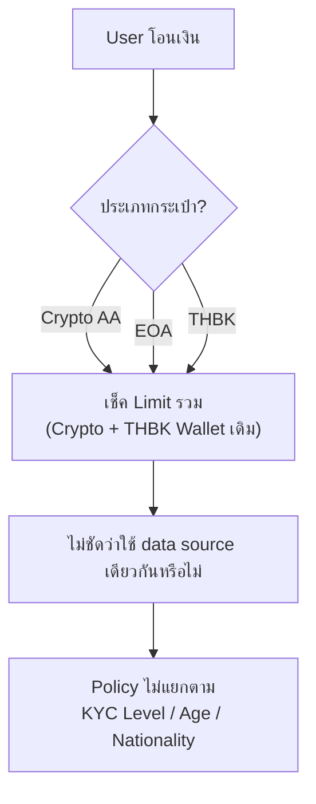
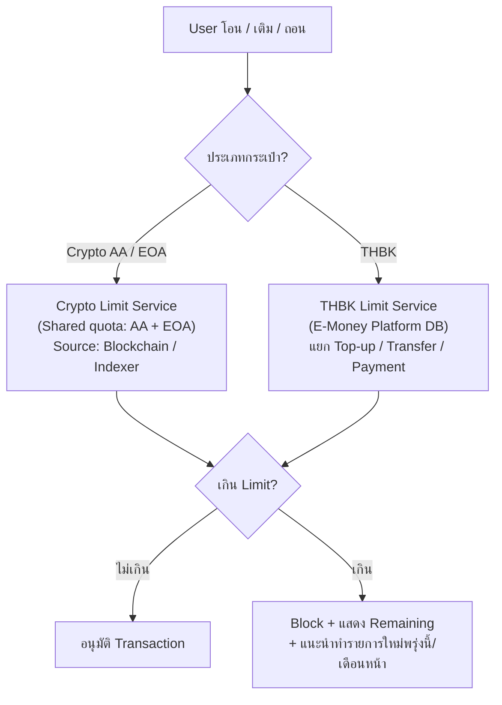
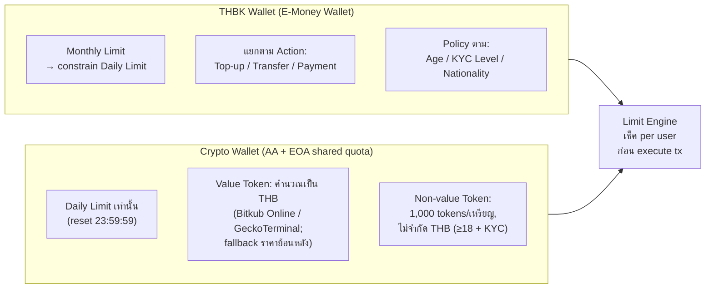

# RFC Input

## 1. RFC Title
KUB-RFC-022 — Transaction Limit Policy — หลักเกณฑ์วงเงินธุรกรรมแยกตามประเภทกระเป๋าและ KYC Level

## 2. Related Grooming
- Epic/Ticket: KUB-RFC-022 — Transaction Limit Policy
- Grooming วงเงินธุรกรรม (2026-02-25): ตัดสินใจแยกวงเงิน THBK Wallet กับ Crypto Wallet (Confirmed, Noom)
- Kickoff Transfer THBK (2026-02-12): THBK Limit แยก Transfer/Withdrawal/Top-up, EOA vs AA TBC
- Kickoff Transfer THBK Final (2026-03-19): THBK Limit logic monthly → daily, policy ตาม Age/KYC/Nationality
- Kickoff Crypto Wallet (2026-03-24): AA Transaction Limit — Non-value token TBC, Progress Bar
- Pending Item #43: Transaction Limit — THBK Wallet vs Crypto (แยก data source) — PENDING
- Pending Item #44: Limit ขาเติม vs ขารับ (stamp หลัง tx) — PENDING
- Pending Item #45: Limit Period (per-day / per-month) — PENDING
- Open Question #83 (questions_for_product.md): AA Transaction Limit — Non-value token, เหรียญ Import — **Noom**
- Open Question #10 (questions_for_product.md): THBK Transfer Limit รวม Top-up + Receive ด้วยหรือไม่ — **Noom / Youko**
- Open Question #16 (questions_for_product.md): Limit ร่วม AA & EOA — **Earn / Noom**

## 3. Problem Statement
KUB Wallet 3.0 มี 3 ประเภทกระเป๋า ได้แก่ **Crypto Wallet (AA)**, **Crypto Classic (EOA)** และ **THBK Wallet (E-Money Wallet)** ซึ่งแต่ละกระเป๋ามีลักษณะทางกฎหมาย ระบบหลังบ้าน และ data source แตกต่างกัน ทำให้ **วงเงินธุรกรรมไม่สามารถใช้ policy เดิมที่รวมกันได้อีกต่อไป**

ปัญหาหลักที่ต้องแก้:
- Version เดิมวงเงิน Crypto กับ THBK Wallet รวมกัน → แยกแล้วต้อง clarify logic แต่ละส่วน
- THBK อยู่ภายใต้ BoT License (E-Money) → มี regulatory limit ต่างจาก Crypto
- AA + EOA ใช้วงเงินร่วมกัน (shared quota) — ต้องออกแบบ aggregation ข้าม wallet type และ **ไม่ migrate EOA limit** มา App v3
- Phase 1 นับเฉพาะ Top-up (ยังไม่รวม Receive / Bridge / On-chain tx) เนื่องจากติดปัญหา Index
- THBK Policy แตกต่างตาม Age / KYC Level / Nationality → อ้างอิง KYC Restriction Sheet
- Crypto ต้อง classify `Value` vs `Non-value Token` ด้วย Moralis และใช้ limit ต่างกัน

### ❌ As-Is — วงเงินรวมกัน ไม่ชัดเจน แยก data source ไม่ได้

### ✅ To-Be — วงเงินแยกต่างหากตามประเภทกระเป๋า

### ภาพรวม Limit Logic ต่อกระเป๋า

## 4. Questions Raised in Grooming

| # | Question | Raised by | Expected answerer | Answer |
|---|---|---|---|---|
| 1 | Crypto AA กับ EOA ใช้วงเงินร่วมกัน (share quota) หรือแยกอิสระ? (Q#16) | Dev | Earn / Noom | **✅ Confirmed (2026-03-30): ใช้วงเงินร่วมกัน (`รวม`)** |
| 2 | THBK Limit: นับรวม Top-up และ Receive เข้าวงเงินด้วยหรือไม่? (Q#10) | Dev | Noom / Youko | **✅ Confirmed (Phase 1): นับเฉพาะยอดที่ลูกค้าเติมจากธนาคาร (Top-up) ยังไม่รวม Receive** เนื่องจากติดปัญหา Index จำนวน transaction on-chain ซึ่งอาจทำให้เกิดเคสเกินยอดได้ → **Phase 1 ไม่รวม Receive แต่อนาคตต้องรองรับ Top-up + Receive** |
| 3 | Limit Period สำหรับ Crypto: per-day, per-month หรือทั้งสอง? (Pending #45) | Dev | Noom | **✅ Confirmed: Crypto = `per-day เท่านั้น`; THBK = `per-day + per-month`** |
| 4 | ขาเติมจากภายนอก (Top-up / Bridge) ยังเช็ก limit แบบ real-time ไม่ได้ และต้อง stamp หลัง transaction — ยอมรับได้หรือไม่ หากอาจเกิน limit ได้ 1 ครั้ง? (Pending #44) | Dev | Noom | **✅ Confirmed (Phase 1): ปัจจุบันมีเฉพาะ Top-up อย่างเดียว ยังไม่มี Receive / Bridge / Transaction on-chain** — อนาคตเมื่อเปิด flow เพิ่มต้องหา solution อีกครั้ง |
| 5 | Non-value token (ไม่มีราคาบน Exchange) — ตัด Limit ออกเลยหรือใช้ Limit อื่น? (Q#83) | Dev | Noom | **✅ Confirmed: ตี Non-value Token มี `limit 1,000 tokens` และ `ไม่จำกัดวงเงิน (THB)` ในกรณีที่ยืนยันตัวตนแล้วและอายุ ≥ 18 ปี** — คงไว้จนกว่าจะมี SOP มาเปลี่ยน limit. **นิยาม Non-value Token = เหรียญที่ไม่สามารถดึงราคาจาก source ต่าง ๆ ได้** |
| 6 | เหรียญที่ Import เข้ามา (Custom Token) — นับรวมวงเงินด้วยหรือไม่? (Q#83) | Dev | Noom | **✅ Confirmed: เหรียญ Import/Custom Token จัดเป็น Non-value Token → ใช้ limit 1,000 tokens ไม่จำกัดวงเงิน (กรณียืนยันตัวตน + อายุ ≥ 18)** — เหมือน Q5. นิยาม Non-value = ดึงราคาจาก source ไม่ได้ |
| 7 | ถ้าไม่มีราคาบน Exchange → ปิดการโอนทันทีหรือ bypass Limit? | Dev | Earn / Noom | **✅ Confirmed: เอาราคาย้อนหลัง (ล่าสุด) มาแสดงและไม่ปิดการโอน** |
| 8 | THBK: Domestic limit ตัวเลขขั้นสุดท้ายคือเท่าไหร่? แตกตาม Age / KYC Level / Nationality อย่างไร? | Dev | Noom / Youko | **✅ Confirmed: อ้างอิงตาม Sheet `KUB Wallet _ KYC Restrictions for Users_V2.0.0_27032025 - Review _ Transaction Limitation (E-Money Wallet)` ได้เลย** |
| 9 | Progress Bar แสดง Remaining Limit — จะอยู่ที่หน้าไหน? (หน้า Transfer / Home / Settings) | Dev | Earn / Fox | **✅ Confirmed: กดตรง Limit ที่หน้า Wallet** — แบ่งเป็น 2 กลุ่ม: `Token` (Design ปรับให้ non-value token เรียบร้อย) และ `THBK` (Design แสดงตาม Sheet) |
| 10 | User อายุ < 18 ปี: Limit ที่ระบุใน Sheet คือ 1,000 THB ยืนยันตัวเลขนี้? และครอบคลุม Wallet ทั้งหมดหรือเฉพาะ THBK? | Dev | Noom | **✅ Confirmed: อ้างอิงตาม Sheet `KUB Wallet _ KYC Restrictions for Users_V2.0.0_27032025` ได้เลย** (Sheet ครอบคลุมเฉพาะ THBK Wallet) |
| 11 | เมื่อ user เกิน Limit: Block ทันที หรือแจ้งเตือนก่อน? CTA ที่ควรแสดงคืออะไร? | Dev | Earn / Fox | **✅ Confirmed: ถ้าเกินวงเงิน ระบบแสดง `error message ใต้ text field` ตอนลูกค้าจะทำธุรกรรม (เติม / โอน / ถอน)** |
| 12 | Limit Reset: reset เวลาเที่ยงคืน local time หรือ UTC? และรายเดือน reset วันที่ 1 หรือ rolling 30 วัน? | Dev | Noom | **✅ Confirmed: End of Day = `23:59:59`; Monthly = `วันสุดท้ายของแต่ละเดือน 23:59:59`** |
| 13 | Non-value token ต้องแบ่งรายเหรียญหรือรวม เพราะปัจจุบันแยกตามเหรียญอยู่? | Dev | Noom | **✅ Confirmed: แบ่งตามเหรียญเลยเหมือนปัจจุบัน** |
| 14 | เนื่องจาก THBK มี transaction limit หลายรูปแบบ หลอด Progress Bar ควรแสดงอย่างไร หรือควรรวมกลุ่ม limit แบบไหนบ้าง? | Dev | Noom / Youko | **✅ Confirmed: แยกหลอดการแสดงผลตาม limit แต่ละประเภท** |
| 15 | EOA เดิมไม่แยก channel limit ระหว่าง transfer ไป external / BO / Bitkub Next ทำให้ limit ถูกรวมทั้งหมด และไม่สามารถแยกคิดราย channel แบบ AA ได้ — ต้องออกแบบและสื่อสาร policy นี้อย่างไรเมื่อใช้ shared quota ร่วมกับ AA? | Dev | Earn / Noom | **✅ Confirmed: ตามข้อที่ 1 (shared quota) — `ไม่ migrate limit จาก EOA มา AA Wallet Limit`** |
| 16 | Daily limit ของ Crypto EOA เดิม ต้อง migrate ไปนับรวมใน shared quota ของ Crypto AA / EOA ด้วยหรือไม่? | Dev | Noom / Youko | **✅ Confirmed: `Limit นับเป็นอันใหม่ตอนขึ้น App v3 เลย` (ไม่ migrate)** |
| 17 | ถ้าเหรียญไหนดึงราคามาได้จาก Moralis จะถือว่าเป็น Value Token และไปเพิ่มใน limit ไหม? | Dev | Earn / Noom | **✅ Confirmed: ถ้าดึงราคาได้ → เข้า `Value Token Limit` (คิดเป็น THB); ถ้าดึงไม่ได้ → เข้า `Non-value Token Limit` (นับเป็นจำนวน token)** |
| 18 | ราคา snapshot ดึงมาจากไหน? | Dev | Earn / Noom | **✅ Confirmed: `Bitkub Online` และ `GeckoTerminal`** |

## 5. Constraints & Limitations Found

- **วงเงินแยก THBK Wallet กับ Crypto — Confirmed (Noom, 2026-02-25)** — data source ต่างกัน: THBK ใช้ E-Money Platform DB, Crypto ใช้ Blockchain / Indexer
- **Limit Period — Confirmed:** Crypto = `per-day เท่านั้น`; THBK = `per-day + per-month` (monthly remaining constrain daily limit)
- **Limit Reset — Confirmed:** End of Day = `23:59:59`; Monthly = `วันสุดท้ายของแต่ละเดือน 23:59:59`
- **THBK Top-up: Min 40 / Max 600,000 THB per transaction — Confirmed** (kickoff 2026-03-19)
- **THBK Phase 1 นับเฉพาะ Top-up ยังไม่รวม Receive** — เนื่องจากติดปัญหา Index จำนวน tx on-chain → อาจเกิดเคสเกินยอด (Phase 2+ ต้องรองรับ)
- **Phase 1 มีเฉพาะ Top-up อย่างเดียว ยังไม่มี Receive / Bridge / Transaction on-chain** — solution สำหรับ stamp delay รอเมื่อเปิด flow เพิ่ม
- **AA vs EOA shared quota — Confirmed as shared quota (`รวม`)** (2026-03-30)
- **ไม่ migrate EOA Daily Limit มา AA** — `Limit นับเป็นอันใหม่ตอนขึ้น App v3 เลย`
- **EOA เดิมไม่แยก limit ตาม channel** — transfer ไป external / BO / Bitkub Next ใช้กอง limit รวมเดียวกัน จึงไม่สามารถคำนวณแบบแยกราย channel เหมือน AA ได้ (policy shared quota ไม่ migrate จาก EOA)
- **Non-value Token (Custom/Import Token) — Confirmed:** `limit 1,000 tokens ต่อเหรียญ`, `ไม่จำกัดวงเงิน (THB)` กรณียืนยันตัวตนและอายุ ≥ 18 ปี, `แยกตามเหรียญ` เหมือนปัจจุบัน — คงไว้จนกว่าจะมี SOP ใหม่
- **นิยาม Non-value Token — Confirmed:** เหรียญที่ไม่สามารถดึงราคาจาก source ต่าง ๆ ได้
- **Classification Value vs Non-value — Confirmed:** ถ้าดึงราคาได้จาก `Moralis` → Value Token (เข้า THB limit); ดึงไม่ได้ → Non-value Token (นับ token)
- **Price Source — Confirmed:** `Bitkub Online` และ `GeckoTerminal`
- **ถ้าไม่มีราคา Real-time** → ใช้ `ราคาย้อนหลัง (ล่าสุด)` มาแสดงและไม่ปิดการโอน (**เปลี่ยนจาก decision เดิมใน kickoff 2026-02-12 ที่ระบุว่า "ปิดการโอน"**)
- **Policy แตกตามกลุ่ม user** — Age / KYC Level / Nationality → design table-driven limit config; ตัวเลข THBK อ้างอิงตาม KYC Restriction Sheet
- **Progress indicator — Confirmed:** แสดงเป็น `Remaining`, วางที่ `Wallet page` (แตะ Limit), **แยกหลอดตาม limit แต่ละประเภท** — Token กลุ่มหนึ่ง, THBK อีกกลุ่ม (ตาม Sheet)
- **Over-limit UX — Confirmed:** แสดง `error message ใต้ text field` ตอนทำธุรกรรม (เติม / โอน / ถอน)

### Findings from Fee Sheets (2026-03-25)

การทบทวน fee sheets ล่าสุดช่วย **ยืนยันโครงสร้าง product/action/segment** ได้บางส่วน แต่ **ยังไม่สามารถใช้ปิด open questions หลักของ transaction limit policy ได้**

- **Crypto Classic (EOA) กับ Crypto Wallet (AA) ใช้ fee matrix คนละชุด** — ช่วยยืนยันว่า product model แยกกันจริง แต่ **ยังไม่ยืนยันว่า limit share quota หรือแยก quota**
- **Pending question tracker ล่าสุดระบุแล้วว่า AA + EOA ใช้ limit ร่วมกัน (`รวม`)** — จึงควรอัปเดต data model และ aggregation logic ให้คิดร่วมกัน
- **THBK action ถูกแยกใน fee sheet ชัดเจน** เป็น `Transfer THBK`, `Payment THBK`, `Topup THBK`, `Withdrawal THBK` — ใช้เป็นหลักฐานประกอบว่า limit config ฝั่ง THBK ควรออกแบบแยกตาม action
- **Account segmentation ใน fee sheet มีอยู่จริงและละเอียดกว่าเดิม** — AA มี `no KYC / no KYB / KYC Lv1 / KYC Lv2 / KYB Lv1`, ส่วน EOA มี `Unverified / Verified`
- **มี free transaction quota หลายรูปแบบ** เช่น `ฟรี 10 ครั้งแรก`, `ฟรีครั้งแรก`, `ฟรี 1 ครั้งแรก` — บ่งชี้ว่าระบบต้องรองรับ counter สำหรับสิทธิ์ฟรีแยกจาก limit counter
- **Fee sheets ไม่ได้ตอบเรื่อง limit period / reset / shared quota / non-value token / imported token / stamp delay** — จึงใช้เป็น supporting evidence ได้ แต่ไม่ควรตีความว่าเป็นคำตอบของ RFC-022 โดยตรง

### Findings from Grooming / Kickoff Notes

- **AA + EOA shared quota = Confirmed** (2026-03-30)
- **Limit Period finalized:** Crypto = per-day, THBK = per-day + per-month; reset EOD 23:59:59 / end-of-month 23:59:59
- **App v3 = fresh limit counter** — ไม่ migrate EOA daily limit มา AA shared quota
- **Phase 1 scope = Top-up เท่านั้น** สำหรับ stamp-delay flow (Receive / Bridge / On-chain tx รอเฟสถัดไป)
- **THBK หน้า input แสดง `remaining today`** และระบบ validate วงเงินทุกครั้งก่อนทำรายการ
- **Remaining limit มีผลต่อ state ปุ่ม** ใน THBK transfer flow จึงมีผลเชิง UX ตั้งแต่หน้า input ไม่ใช่เฉพาะตอน submit
- **Progress Bar = Remaining, placement = Wallet page (แตะ Limit), แยกหลอดตามประเภท**
- **Custom/Import Token = Non-value Token** มี limit 1,000 tokens/เหรียญ, ไม่จำกัด THB (ยืนยันตัวตน + อายุ ≥ 18), แยกตามเหรียญ
- **Price source: Bitkub Online + GeckoTerminal; classification ใช้ Moralis** (ดึงได้ = Value, ดึงไม่ได้ = Non-value)
- **Over-limit UX:** error message ใต้ text field (ไม่ block แบบ hard-stop modal)

## 6. Proposed Approach (high-level)

ออกแบบ **Limit Engine แยกสำหรับ 2 domain** (Crypto / THBK) โดยใช้ **Table-driven config** เพื่อรองรับ policy ที่แตกต่างตาม Age / KYC Level / Nationality โดยไม่ต้อง hardcode

---

### Crypto Wallet Limit (AA / EOA)

| Dimension | รายละเอียด |
|---|---|
| หน่วยคำนวณ | Value Token = THB (coin amount × ราคาจาก Bitkub Online / GeckoTerminal); Non-value Token = จำนวน token |
| Period | **Daily เท่านั้น** (reset 23:59:59) |
| Scope | AA + EOA ใช้วงเงินร่วมกัน (shared quota) — ไม่ migrate จาก EOA App v2 |
| Classification | Moralis ดึงราคาได้ → Value Token → เข้า THB daily limit; ดึงไม่ได้ → Non-value Token → เข้า token limit |
| Non-value Token Policy | `1,000 tokens / เหรียญ` + `ไม่จำกัดวงเงิน THB` (ยืนยันตัวตน + อายุ ≥ 18) — แยกตามเหรียญ, คงไว้จนมี SOP ใหม่ |
| Custom / Import Token | นับเป็น Non-value Token → ใช้ policy เดียวกัน |
| กรณีไม่มีราคา Real-time | **ใช้ราคาย้อนหลัง (ล่าสุด) และยังโอนได้** (ไม่ปิดการโอน) |

### THBK Wallet Limit

| Action | Min | Max per TX | Daily Limit | Monthly Limit |
|---|---|---|---|---|
| Top-up | 40 THB | 600,000 THB | ตาม KYC/Age/Nationality (Sheet) | ตาม KYC/Age/Nationality (Sheet) |
| Transfer (KUB/Join/Bank) | > Fee | TBC | ตาม Sheet | ตาม Sheet |
| Payment (Merchant) | > 0 | TBC | ตาม Sheet | ตาม Sheet |

> **Limit Logic:** Monthly remaining → constrain Daily limit (ถ้า monthly เหลือน้อยกว่า daily → daily ถูก cap ตาม monthly)
> **Phase 1:** นับเฉพาะ `Top-up` ยังไม่รวม `Receive`; reset daily 23:59:59 / monthly วันสุดท้ายของเดือน 23:59:59

### Limit Config Table (Table-driven)

> ตัวเลข Daily / Monthly อ้างอิงตาม `KUB Wallet _ KYC Restrictions for Users_V2.0.0_27032025 - Review _ Transaction Limitation (E-Money Wallet)` โดยตรง — RFC นี้ไม่ซ้ำค่าเพื่อลด drift; implementation โหลด config จาก table-driven source ที่ sync กับ Sheet

---

### ประเมิน Cost & Time

| รายการ | ประเมิน | หมายเหตุ |
|---|---|---|
| Backend: Crypto Limit Service (daily only, shared AA+EOA quota) | 1–2 สัปดาห์ | fresh counter ตอน App v3, aggregation ข้าม wallet type |
| Backend: Value/Non-value Classification via Moralis + fallback ราคาย้อนหลัง | 1 สัปดาห์ | integrate Bitkub Online + GeckoTerminal |
| Backend: Non-value Token limit (1,000 tokens/เหรียญ, แยกเหรียญ) | 0.5–1 สัปดาห์ | |
| Backend: THBK Limit Service (monthly → daily, Top-up Phase 1) | 1–2 สัปดาห์ | ใช้ E-Money Platform data, reset EOD / end-of-month 23:59:59 |
| Backend: Table-driven Limit Config sync กับ KYC Restriction Sheet | 1 สัปดาห์ | config table + admin API |
| Mobile App: Progress Bar Remaining (Wallet page, แยกหลอดต่อ limit) | 1 สัปดาห์ | Token + THBK 2 กลุ่ม |
| Mobile App: Error message ใต้ text field ตอนเกิน limit | 0.5 สัปดาห์ | |
| QA: Edge cases (Moralis classification, price fallback, shared quota, Non-value token) | 1 สัปดาห์ | |
| **รวมประมาณ** | **~6–8 สัปดาห์** | Phase 1 เท่านั้น (Receive / Bridge Phase 2+) |

#### ระดับความเสี่ยง: 🔴 สูง

| ความเสี่ยง | ระดับ | เหตุผล |
|---|---|---|
| Shared quota AA + EOA ต้อง aggregate usage ข้าม wallet type ให้ถูกต้อง | สูง | ถึง policy confirm แล้ว แต่ถ้า data model/aggregation ผิดจะทำให้คำนวณวงเงินผิด |
| THBK Limit values ตาม Sheet — Sheet ยัง review อยู่ อาจมีการเปลี่ยน | กลาง | ใช้ config table-driven เพื่อรองรับการเปลี่ยนแปลง |
| Moralis classification หรือ price source downtime | กลาง | fallback ราคาย้อนหลัง + default Non-value เมื่อไม่แน่ใจ |
| Phase 1 ไม่รวม Receive → compliance gap จนกว่าจะเปิด Phase 2 | กลาง | ระบุใน Product spec; รอแก้ index on-chain |
| Non-value Token 1,000 tokens อาจไม่เหมาะกับบางเหรียญ (value ต่อ token ต่างกันมาก) | ต่ำ | รอ SOP ใหม่มา override ได้ |

## 7. System Actors & Components

| Actor/Component | Type | Description |
|---|---|---|
| Mobile App | User-facing | แสดง Progress Bar remaining limit, error state เมื่อเกิน limit, CTA แนะนำ |
| Crypto Limit Service | Service | คำนวณ remaining daily/monthly limit สำหรับ AA/EOA — ดึงข้อมูลจาก Blockchain / Indexer |
| THBK Limit Service | Service | คำนวณ remaining daily/monthly limit สำหรับ THBK — ดึงจาก E-Money Platform DB |
| Limit Config Store | Database/Config | Table-driven: เก็บ limit ตาม Age / KYC Level / Nationality per action type |
| Price Source (Bitkub Online / GeckoTerminal) | External | ราคา coin สำหรับแปลง amount → THB; ถ้า real-time ไม่มา ใช้ราคาย้อนหลังล่าสุด |
| Moralis | External | ใช้ classify เหรียญเป็น Value vs Non-value (ดึงราคาได้ = Value, ไม่ได้ = Non-value) |
| KYC Service | Service | ดึง KYC Level + Age + Nationality ของ user สำหรับ lookup limit config |
| Backoffice | Internal Tool | Admin ปรับ limit config table โดยไม่ต้อง redeploy |

## 8. Key Flows (plain language)

### Flow 1: User โอน Crypto (Value Token) — ปกติ (ไม่เกิน Limit)
1. User กรอกจำนวน coin ที่ต้องการโอน
2. App ส่งไปยัง Crypto Limit Service: "คิดเป็น X THB ใช่ไหม? remaining daily เหลือเท่าไหร่?"
3. Service ตรวจว่าเหรียญเป็น Value (Moralis ดึงราคาได้) → ดึงราคาจาก Bitkub Online / GeckoTerminal → แปลง amount → THB
4. เช็ค remaining **daily** limit ของ shared quota (AA + EOA รวม)
5. ไม่เกิน → อนุมัติ → แสดง Review หน้าก่อน Confirm
6. อัพเดต limit tracker หลัง tx สำเร็จ

### Flow 2: User โอน Crypto — เกิน Limit
1. User กรอกจำนวนที่เกิน remaining limit
2. Limit Service ตรวจพบเกิน
3. App แสดง **error message ใต้ text field**: "วงเงินต่อวันเหลือ X THB"
4. ปุ่มดำเนินการถูก disable จนกว่าจะปรับจำนวน

### Flow 3: THBK Top-up — Limit monthly → daily
1. User กรอก amount Top-up
2. THBK Limit Service เช็ค monthly remaining → คำนวณว่า daily cap วันนี้คือเท่าไหร่
3. ถ้า amount ≤ daily cap → อนุมัติ
4. ถ้า amount > daily cap → แสดง error ใต้ text field: "วงเงินต่อวันเหลือ X THBK" + disable ปุ่ม
5. Phase 1 นับเฉพาะ Top-up (ไม่รวม Receive); reset daily 23:59:59 / monthly วันสุดท้ายของเดือน 23:59:59

### Flow 4: ขาเติม (Top-up) Stamp delay — Phase 1
1. User Top-up จากภายนอก (QR Bank)
2. ระบบรับ tx → Stamp ยอดหลัง tx เสร็จ (ไม่ real-time)
3. Phase 1 scope = Top-up เท่านั้น ยังไม่มี Receive / Bridge / On-chain tx
4. กรณีเปิด flow Receive / Bridge ในอนาคต → ต้องหา solution เพิ่มเติม (Phase 2+)

### Flow 5: Non-value Token / Custom Token — ไม่สามารถดึงราคาได้
1. User พยายามโอน token ที่ Moralis ดึงราคาไม่ได้
2. ระบบจัด classify เป็น Non-value Token
3. ใช้ **limit แยก: 1,000 tokens ต่อเหรียญ** (แยกตามเหรียญ)
4. กรณียืนยันตัวตนแล้วและอายุ ≥ 18 ปี → **ไม่จำกัดวงเงิน THB** (ใช้เฉพาะ token count limit)
5. นโยบายคงไว้จนกว่าจะมี SOP ใหม่

### Flow 6: ราคา Real-time ดึงไม่ได้ชั่วคราว
1. User โอน Value Token ตามปกติ
2. Price Source (Bitkub Online / GeckoTerminal) ไม่ตอบ real-time
3. ระบบ **ใช้ราคาย้อนหลัง (ล่าสุด) แสดงผลและยังเปิดให้โอนได้** (ไม่ block การโอน)
4. Limit คำนวณด้วยราคาย้อนหลัง — อาจคลาดเคลื่อนเล็กน้อย (accepted risk)

## 9. Alternatives Considered

| Option | Pros | Cons | Why not chosen |
|---|---|---|---|
| วงเงินรวม Crypto + THBK เหมือนเดิม | implement ง่าย | ต่างกัน 2 regulatory framework, 2 data source — ไม่ถูกต้องตาม compliance | ไม่สอดคล้องกับ BoT E-Money license |
| Migrate EOA daily limit มา AA shared quota | ต่อเนื่องจาก App v2 | ซับซ้อน data model, ต้อง backfill, risk คำนวณผิด | Product confirm: start fresh ตอน App v3 |
| ปิดการโอนเมื่อราคา real-time ไม่มา | ปลอดภัยสูง (ไม่เกิน limit จริง) | UX แย่มาก — user โอนไม่ได้เมื่อ source down | Product confirm: ใช้ราคาย้อนหลังแทน |
| Crypto ใช้ daily + monthly limit เหมือน THBK | consistent กับ THBK | เพิ่ม complexity ที่ไม่จำเป็นสำหรับ Crypto | Product confirm: Crypto per-day อย่างเดียว |
| Hardcode THBK limit ต่อ segment | implement เร็ว | เปลี่ยน policy ต้องเปลี่ยน code | ใช้ table-driven config sync กับ KYC Restriction Sheet |

## 10. Out of Scope
- **Gas Fee Limit** — อยู่ใน RFC-043 (Gas Fee Transfer Policy)
- **Transaction Fee Schedule / Free Transfer Quota Policy** — เป็นคนละ scope กับ Transaction Limit แม้จะมีผลต่อ UX และ counter logic
- **KUB Shop Transaction Limit** — แยก scope KUB Shop
- **Backoffice: Manual Override Limit** — Future scope
- **Cross-wallet limit aggregation** (นับยอด AA + THBK รวมกันสำหรับ regulatory) — Compliance scope แยก

## 11. Risks

| Risk | Impact | Mitigation |
|---|---|---|
| THBK Limit numbers ยัง sync จาก Sheet ไม่มี source of truth ชัดเจน | Medium | ใช้ table-driven config; กำหนด owner ของ Sheet + process sync |
| Shared quota AA/EOA implement ผิด — data model และ aggregation คิดไม่ครบ | High | ออกแบบ schema/query ให้รวม usage ข้าม wallet type ตั้งแต่ต้น; App v3 start fresh ไม่ migrate |
| Phase 1 ไม่รวม Receive ทำให้ยอดเข้าจริง ≠ limit counter | Medium | ระบุใน TOS / Product spec; Phase 2 ต้องแก้ index on-chain ก่อนเปิด |
| ราคา real-time ดึงไม่ได้ → ใช้ราคาย้อนหลัง อาจ under/over limit | Medium | ยอมรับได้; monitor lag; flag ใน audit log |
| Moralis classification ผิดพลาด (Value → Non-value หรือกลับกัน) | Medium | มี fallback: default = Non-value ถ้า classification ไม่แน่ชัด; re-check เมื่อราคากลับมา |
| Non-value Token policy (1,000 tokens) ไม่เหมาะกับบางเหรียญ | Low | รอ SOP ใหม่; config แยกรายเหรียญได้ |

## 12. Reviewers Required

| Role | Name |
|---|---|
| Tech Lead | Benz |
| Product Owner | Noom / Youko |
| Crypto PO | Earn |
| UX | Fox |
| Compliance / 2nd Line | (Limit table per Age/KYC/Nationality — ต้อง confirm) |

## 13. References
- Grooming วงเงินธุรกรรม (2026-02-25): `meeting-notes/2026-02-25-continue-grooming-wallet.md`
- Kickoff Transfer THBK (2026-02-12): `kickoff-meetings/2026-02-12-kickoff-transfer-THBK.md` — Limit EOA vs AA, THBK แยกวงเงิน
- Kickoff Transfer THBK Final (2026-03-19): `kickoff-meetings/2026-03-19-kickoff-transfer-THBK-final.md` — THBK Limit logic + policy
- Kickoff Crypto Wallet (2026-03-24): `kickoff-meetings/2026-03-24-kickoff-crypto-wallet.md` — AA Transaction Limit, Non-value token
- questions_for_product.md: Q#83 (AA Transaction Limit), Q#10 (THBK Transfer Limit), Q#16 (Limit ร่วม AA/EOA)
- pending-items.md: Pending #43 (THBK Wallet vs Crypto data source), #44 (ขาเติม stamp), #45 (Limit period)
- KUB-RFC-043: Gas Fee Transfer Policy (สัมพันธ์กับ limit calculation)
- KUB-RFC-045: Gas Fee Sponsorship (สัมพันธ์กับ free tx quota)
- `KUB Wallet _ Fees V.1_25032026 - 🚩 (Crypto Classic) Transaction Fees.csv` — evidence for EOA fee segmentation and free-transfer rules
- `KUB Wallet _ Fees V.1_25032026 - 🚩 (Crypto) Transaction Fees.csv` — evidence for AA fee segmentation, THBK action taxonomy, and free-transfer rules
- Google Sheet reference: https://docs.google.com/spreadsheets/d/1Nc60fnrRZiIHpPql6-qzrmUcX-iH_H-AL3Ku1qktq5k/edit?usp=sharing
