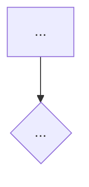
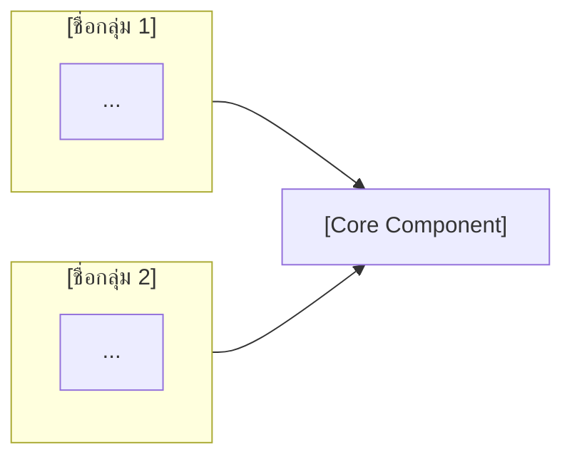

# RFC Input

## 1. RFC Title
KUB-RFC-[NUMBER] — [Short Title] — [คำอธิบายสั้น ๆ ภาษาไทย]

## 2. Related Grooming
- Epic/Ticket: [Ticket ID] — [Title]
- Grooming [YYYY-MM-DD]: [สรุป decision ที่ได้ + ใครยืนยัน]
- Kickoff [YYYY-MM-DD]: [สรุป decision ที่ได้]
- Pending Item #[N]: [หัวข้อ] — PENDING
- Open Question #[N] (questions_for_product.md): [คำถาม] — **[ชื่อผู้รับผิดชอบตอบ]**

## 3. Problem Statement
[อธิบาย context และปัญหาที่ต้องแก้ใน 2–3 ย่อหน้า]

ปัญหาหลักที่ต้องแก้:
- [ปัญหา 1]
- [ปัญหา 2]
- [ปัญหา 3]

### ❌ As-Is — [สภาพปัจจุบัน สั้น ๆ]

### ✅ To-Be — [สภาพที่ต้องการ สั้น ๆ]

### ภาพรวม [ชื่อ Logic หลัก]

## 4. Questions Raised in Grooming

| # | Question | Raised by | Expected answerer | Answer |
|---|---|---|---|---|
| 1 | [คำถาม] | Dev / PM | [ชื่อ] | **[✅ Confirmed / ⏳ Pending]: [คำตอบ]** |
| 2 | [คำถาม] | Dev / PM | [ชื่อ] | **[✅ Confirmed / ⏳ Pending]: [คำตอบ]** |

## 5. Constraints & Limitations Found

- **[Constraint 1] — Confirmed ([ชื่อ], [YYYY-MM-DD]):** [รายละเอียด]
- **[Constraint 2] — Confirmed:** [รายละเอียด]
- **[Pending item] — TBD:** [รายละเอียด]

### Findings from [Source เช่น Fee Sheets / Grooming Notes] ([YYYY-MM-DD])

- **[Finding 1]** — [สรุปสั้น ๆ]
- **[Finding 2]** — [สรุปสั้น ๆ]

## 6. Proposed Approach (high-level)

[อธิบาย approach หลัก 1–2 ประโยค]

---

### [Component / Domain 1]

| Dimension | รายละเอียด |
|---|---|
| [หัวข้อ] | [รายละเอียด] |
| [หัวข้อ] | [รายละเอียด] |

### [Component / Domain 2]

| Action | Min | Max per TX | Daily Limit | Monthly Limit |
|---|---|---|---|---|
| [Action 1] | — | — | [ค่า] | [ค่า] |

> **[หมายเหตุ หรือ logic พิเศษ]**

### ประเมิน Cost & Time

| รายการ | ประเมิน | หมายเหตุ |
|---|---|---|
| [งาน 1] | [N สัปดาห์] | [หมายเหตุ] |
| [งาน 2] | [N สัปดาห์] | [หมายเหตุ] |
| **รวมประมาณ** | **~[N–M] สัปดาห์** | [scope ที่ครอบคลุม] |

#### ระดับความเสี่ยง: 🔴 สูง / 🟡 กลาง / 🟢 ต่ำ

| ความเสี่ยง | ระดับ | เหตุผล |
|---|---|---|
| [ความเสี่ยง 1] | สูง / กลาง / ต่ำ | [เหตุผล] |

## 7. System Actors & Components

| Actor/Component | Type | Description |
|---|---|---|
| [ชื่อ] | User-facing / Service / Database / External / Internal Tool | [คำอธิบาย] |

## 8. Key Flows (plain language)

### Flow 1: [ชื่อ Flow — สถานการณ์ปกติ]
1. [Step 1]
2. [Step 2]
3. [Step 3]

### Flow 2: [ชื่อ Flow — กรณี edge case หรือ error]
1. [Step 1]
2. [Step 2]

## 9. Alternatives Considered

| Option | Pros | Cons | Why not chosen |
|---|---|---|---|
| [Option 1] | [ข้อดี] | [ข้อเสีย] | [เหตุผลที่ไม่เลือก] |
| [Option 2] | [ข้อดี] | [ข้อเสีย] | [เหตุผลที่ไม่เลือก] |

## 10. Out of Scope
- **[หัวข้อ]** — [เหตุผลสั้น ๆ หรืออ้างอิง RFC อื่น]
- **[หัวข้อ]** — [เหตุผล]

## 11. Risks

| Risk | Impact | Mitigation |
|---|---|---|
| [ความเสี่ยง] | High / Medium / Low | [แนวทางลดความเสี่ยง] |

## 12. Reviewers Required

| Role | Name |
|---|---|
| Tech Lead | [ชื่อ] |
| Product Owner | [ชื่อ] |
| UX | [ชื่อ] |
| Compliance / 2nd Line | [ชื่อ หรือ TBD] |

## 13. References
- [Meeting/Grooming YYYY-MM-DD]: `[path/to/file.md]` — [สรุปว่ามี decision อะไรบ้าง]
- [Document]: `[path/to/file]`
- [Related RFC]: KUB-RFC-[N] — [ชื่อ]
- [External link]: [URL หรือ Google Sheet]
